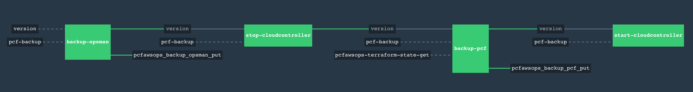

# Backing up PCF
**Assumption** PCF backup process will backup only Ops Manager and Elastic Runtime. Any artifacts created by tiles (e.g rabbitmq queues and databases created by AWS Service Broker) are not backed up by this process. It is the responsibility of app dev team to have process to provision them in disaster recovery scenarios.    
**Note** After initiating the backup verify that all the jobs are completed successfully and the files are uploaded in s3 bucket. Because the backup is several giga bytes, the operation can time out and may require restart.  
  
Following is the concourse pipeline will backup PCF foundation.  


Following is the sequence.  
1. Backup Ops Manager  
2. Stop Cloud Controller  
	&nbsp;&nbsp;&nbsp;&nbsp;&nbsp;&nbsp;cf cli commands will not work after this job runs. Apps will continue to work, but you won't be able to scale the app or push new apps.  
3. Backup PCF  
&nbsp;&nbsp;&nbsp;&nbsp;&nbsp;&nbsp;a. backup bosh db  
&nbsp;&nbsp;&nbsp;&nbsp;&nbsp;&nbsp;b. backup deployment manifests    
&nbsp;&nbsp;&nbsp;&nbsp;&nbsp;&nbsp;b. backup s3  
5. Start Cloud Controller  
&nbsp;&nbsp;&nbsp;&nbsp;&nbsp;&nbsp;cf cli commands will continue to work.  
6. The backup will create two files in s3  
&nbsp;&nbsp;&nbsp;&nbsp;&nbsp;&nbsp;yyyy-MM-dd:HH:mi:ss-ops-manager.zip  
&nbsp;&nbsp;&nbsp;&nbsp;&nbsp;&nbsp;yyyy-MM-dd:HH:mi:ss-pcf-backup.tgz  

# Preparing AWS for backup
1. Create VPC Peerting Connection between bootstrap and pcf VPCs  
2. In bootstrap VPC, add route to 10.3.16.11/32 in "**ENV**-Bootstrap Private Subnet Route Table AZ1"  
3. In pcf VPC, add route to 10.4.6.0/24 in "**ENV**-Private Subnet Route Table AZ1"  
in "**ENV**-PCF VMs Security Group", allow connections from 10.4.6.0/24 to All traffic and all ports.  

# Create UAA user for backup  
**Reference:** https://discuss.pivotal.io/hc/en-us/articles/221695507-How-to-log-on-BOSH-in-non-interactive-scripts-Internal-Article  
1. uaac --skip-ssl-validation target https://10.3.16.11:8443  
2.  uaac token owner get login admin -s CLIENT_SECRET -p USER_PASSWORD
        CLIENT_SECRET => Credentials -> Uaa Login Client Credentials
        USER_PASSWORD => Uaa Admin User Credentials
3. uaac client add backup.user --scope uaa.none --authorized_grant_types client_credentials --authorities bosh.admin -s [BACKUP_PWD]
4. uaac token client get backup.user -s [BACKUP_PWD]
5. BOSH_CLIENT=backup.user BOSH_CLIENT_SECRET=backupPwd bosh --ca-cert /var/tempest/workspaces/default/root_ca_certificate status  
6. 
# Setting up concourse pipeline
1. Create parameter file for given environment.
2. Create pipeline 

	```
	$ fly -t sonic-sandbox login --username <USER> --password <PASSWORD>  
	$ fly -t sonic-sandbox set-pipeline -p backup-pcf -c aws_backup_pipeline.yml --load-vars-from sonic_**ENV**_aws_backup_params.yml  
	$ fly -t sonic-sandbox unpause-pipeline --pipeline backup-pcf
	```
3. Unpause pipeline

# Setting up Scheduled task to run the piepline
**Important** Verify that backup is complete after schedule job runs. The pipeline does not auto recover from the error.  
Edit your crontab file `crontab -e` as follows to schedule backup on 1:00 am every day.

```
SHELL=/bin/bash
0 1 * * * /home/ubuntu/pcf-backup/trigger_backup.sh >> /home/ubuntu/pcf-backup/pcf-backup.log 2>&1
```
Restart the cron job

```
$ sudo service cron restart
```
# Cleaning up backups.
Login to AWS s3 and manually delete the old backups.
# When to backup
Following are suggesions on whey to run backups.  
1. Run backup eveytime you change in Ops Manager that requies to `Apply Changes`  
2. Run backup before major deployment milestones.  
3. Run backups periodically - probably once couple of days or once a week.  

# Restoring from backup
**Important** Ops Manager backup can only be restored on newly provisioned Ops Manager. **Do not** `Import Existing Installation` on alredy configured ops manager.  
Follow [directions](https://docs.pivotal.io/pivotalcf/1-8/customizing/backup-restore/restore-pcf.html) here.  
1. Import existing installation  
2. Login to New Ops Manager and change something (e.g NTP Servers) to trigger new deployment.  
3. Login to New ops manager vm and delete `/var/tempest/workspaces/default/deployments/bosh-deployments.yml` and `/var/tempest/workspaces/default/deployments/bosh-state.json` files.  
4. Login to Ops Manager and do `Apply Changes`  
5. Extract `<yyyy-MM-dd:HH:mi:ss>-pcf-backup.tgz` file and copy the s3 folders into corresponding s3 buckets.

