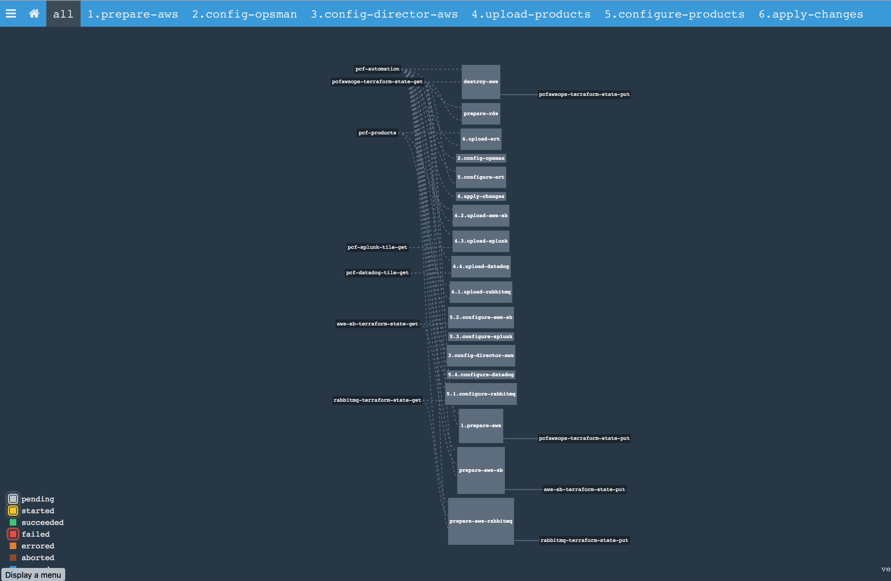
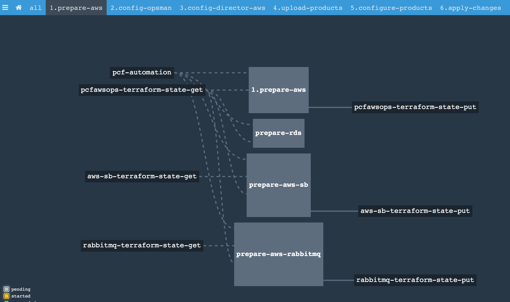
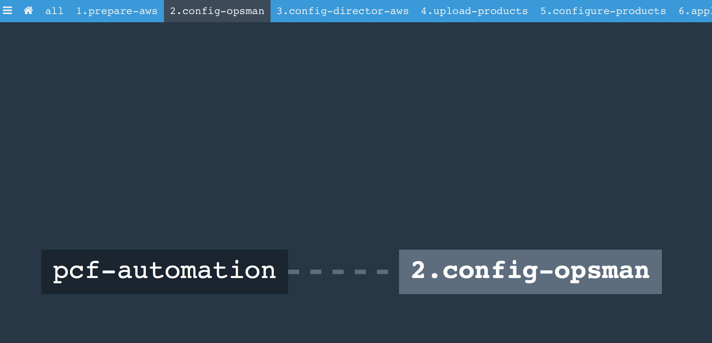
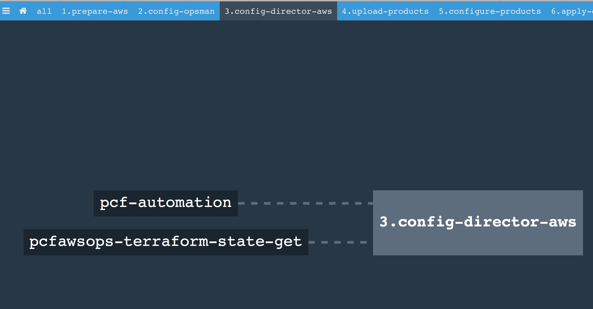
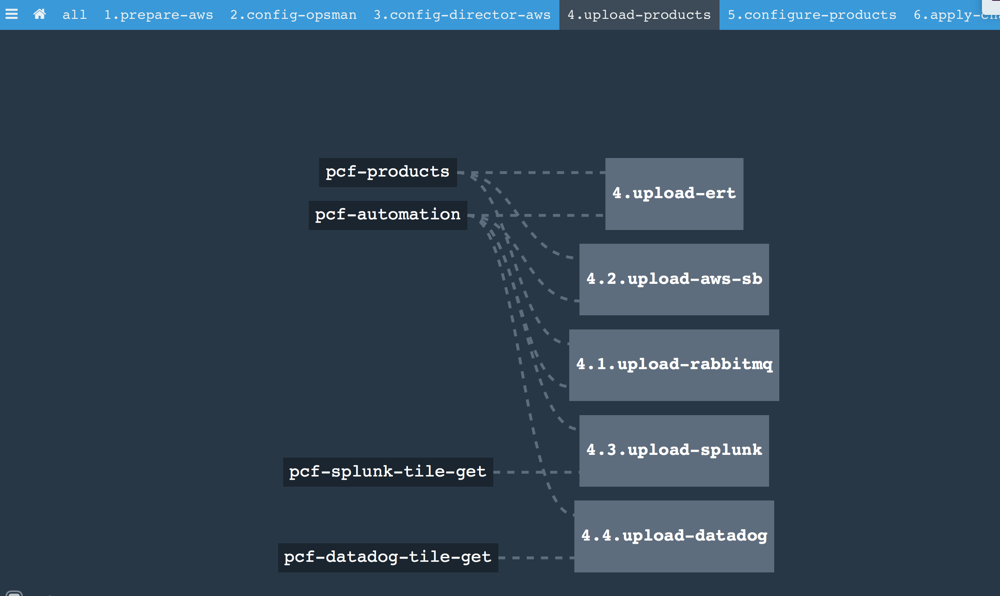
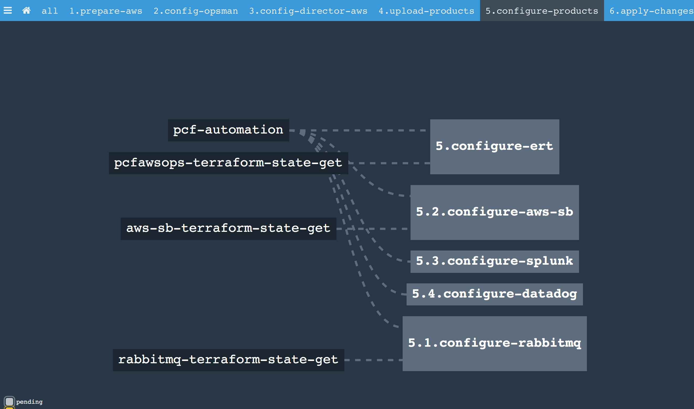
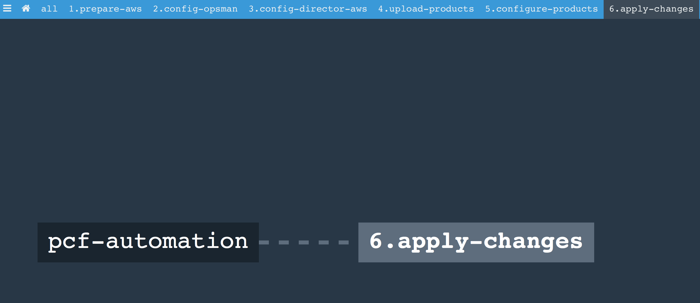

# Concourse Pipeline to install PCF

## Getting Started
1. Copy `sample/aws_pcf_install_params.yml` and replace the parameters
2. Create pipeline `fly -t pcf set-pipeline -p pcf-deploy-aws -c aws_pcf_install_pipeline.yml --load-vars-from aws_pcf_install_params.yml`

## 1. prepare-aws
### 1. prepare-aws

Creates infrastrucure in AWS where PCF is be deployed.  
1. Create One VPC  
2. Creates 3 subnets - one in each avaiaility zones  
3. Create 3 Nat Instances to allow outbound internet traffic  
4. Create 3 Elbs (for http, tcp and ssh traffics)  
5. Create one RDS for PCF components  
6. Create Ops Manager VM 

### prepare-rds
Create `uaa, ccdb, notifications, autoscale, app_usage_service and console` databases in RDS

### prepare-aws-sb
Create AWS infrastructure to support AWS service broker
### prepare-aws-rabbitmq
Create AWS infrastructure to support RabbitMQ
## 2. config-opsman
Configure opsmanager with internal authentication  

## 3. config-director-aws
Configure Ops Manager Director  

## 4. upload-products
Download the products from `network.pivotal.io`, upload then to Ops Manager and stage then for configuration/deployment. Currently following products are staged.  
1. Elastic Run Time  
2. RabbitMQ Tile  
3. AWS Service Broker Tile  
4. Splunk-ecs tile (downloaded from s3)  
5. Datadog-ecs tile (downloaded from s3)  

## 5. configure-products
Configure the staged products  
1. Elastic Runtime  
	a. Configures 2 network - deployment and service  
	b. Configures 3 subnets in each network, one for each availabiltiy zone  
	c. Configures 3 vms for HA PCF components one in each availability zone
2. RabbitMQ  
3. AWS Service Broker  
4. Splunk  
5. Datadog

## 6. apply-changes
Deploy the changes

 