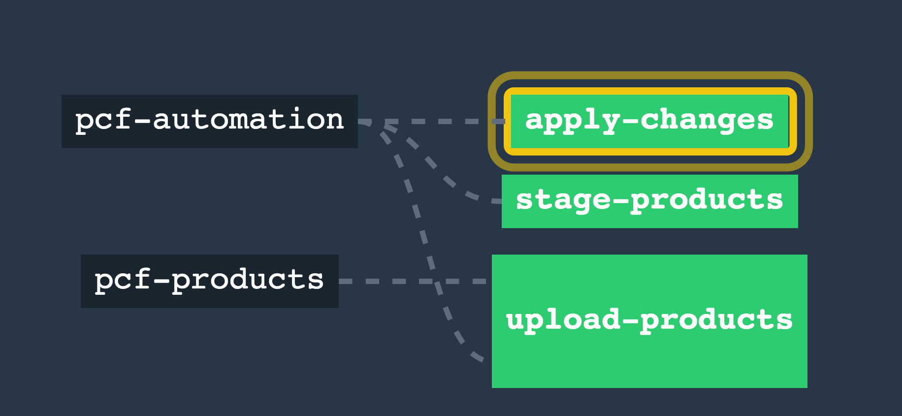

# Prepare Pipeline for upgrade process
*** Note: *** It is still the responsibility of the ops engineer to check for product compatibilities. Automation is not substitute for due diligence.  

### Run upgrade_init.sh
It will create sample `ci/pcf_upgrade_params.yml` file. Modify the `upload-products` job in `upgrade_pipeline.yml` as needed.

### Load the pipeline to councourse
```
fly -t local set-pipeline -p pcf-upgrade -c upgrade_pipeline.yml --load-vars-from pcf_upgrade_params.yml
fly -t local unpause-pipeline -p pcf-upgrade
```
### Upgrading PCF
The upgrade process is a three step process. While it is possible to trigger the steps automatically after completion of previous steps, it is good practice to check the environment after execution of each step.  

#### Upload products
Upload products will download the products specified in the `upload-products` job in the upgrade pipeline and upload it to the ops manager. After running this job login to ops manager and verify that the product versions uploaded are correct.
#### Stage products
Stage products will stage the uploaded products for deployment. Note that only products that are already installed will be staged. After running he job login to ops manager and verify that products are staged for deployment.
#### Apply changes
Apply changes will deploy the new product versions. After running he job login to ops manager and verify that PCF is upgraded and there are no pending changes.

### Additional Notes:
1. The details of mypivnet resource can be found in [https://github.com/rsamban/pivnet-resource](https://github.com/rsamban/pivnet-resource)
2. The detauls of pcf-om docker container can be found at [https://github.com/rsamban/pcf-om](https://github.com/rsamban/pcf-om)